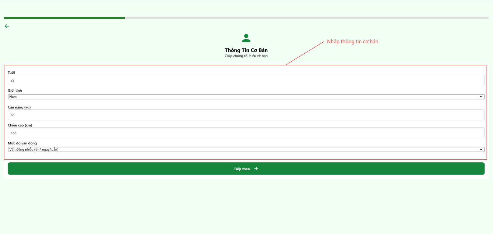
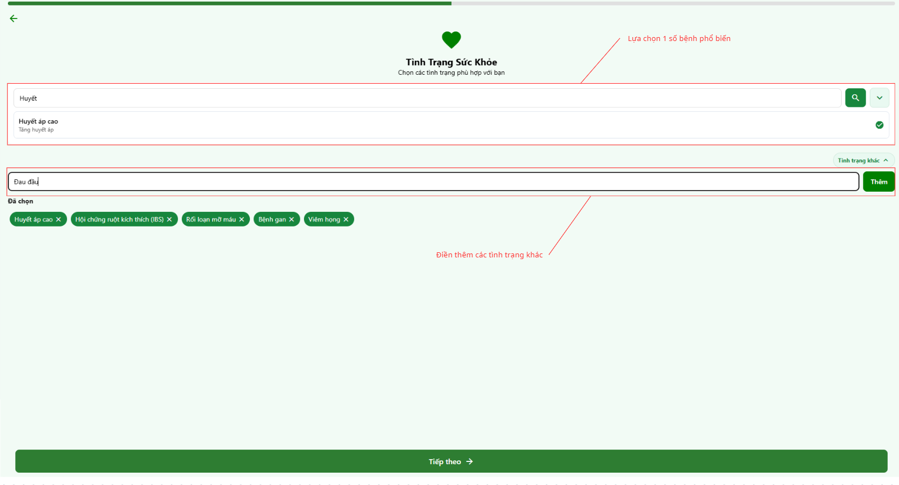
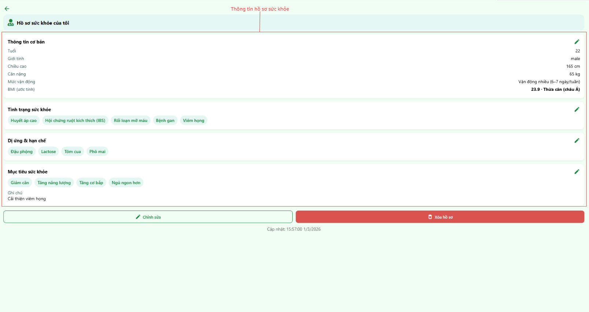
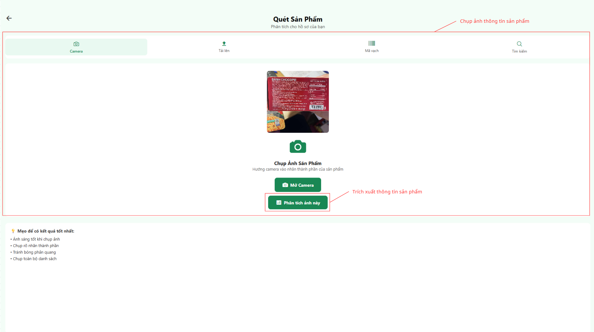
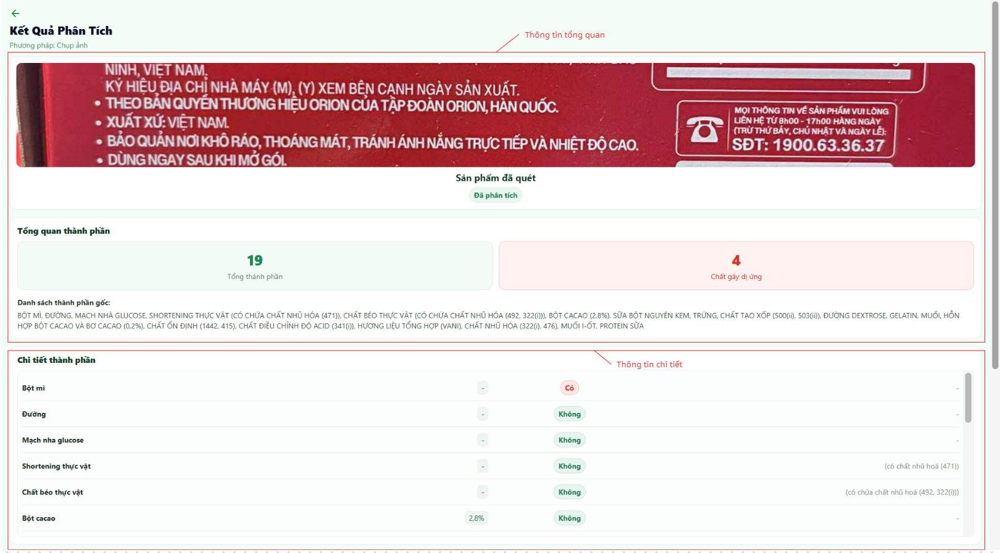
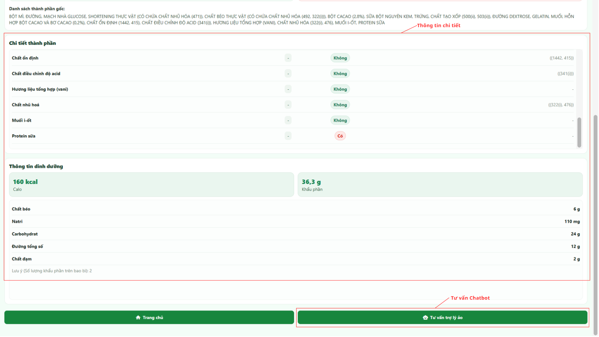
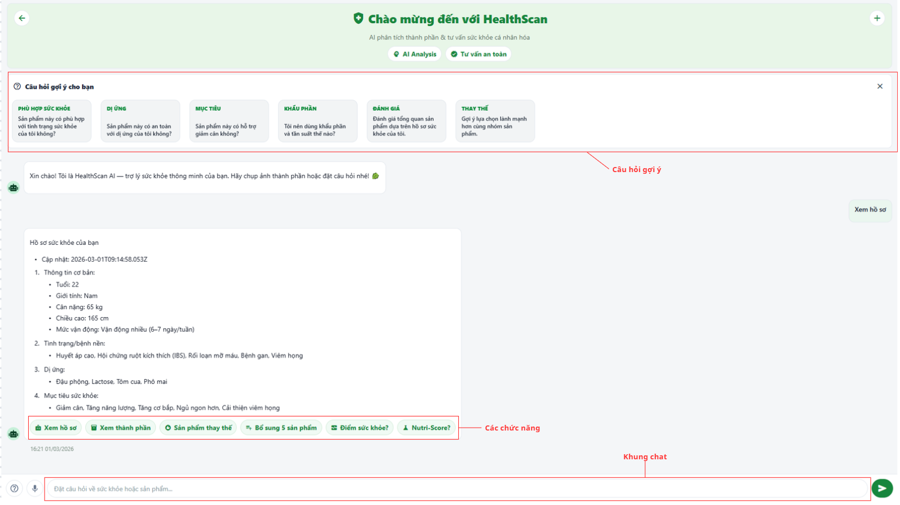
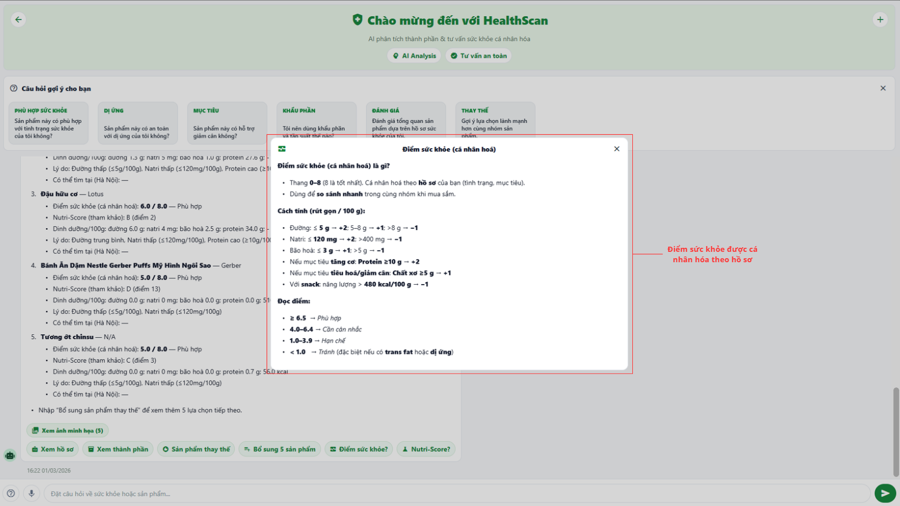
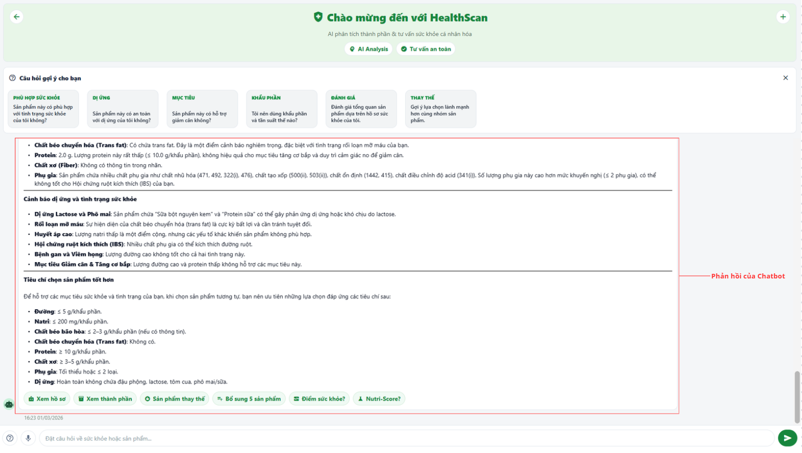

# HEALTHSCAN PRO: AI-POWERED SMART HEALTH ASSISTANT

## PROJECT OVERVIEW
**HealthScan Pro** là một hệ thống hỗ trợ quản lý dinh dưỡng cá nhân hóa, kết hợp sức mạnh của mô hình đa phương thức **Vision Language Model (Google Gemini Flash)** và cơ sở dữ liệu thực phẩm mã nguồn mở **OpenFoodFacts**. Dự án được phát triển nhằm giải quyết thách thức trong việc đọc hiểu các nhãn thành phần phức tạp, giúp người dùng đưa ra quyết định tiêu dùng thông minh dựa trên chính hồ sơ bệnh lý, dị ứng và mục tiêu sức khỏe cá nhân.

## KEY FEATURES
- **Personalized Health Profiling:** Thiết lập hồ sơ sinh học chi tiết bao gồm chỉ số BMI, tình trạng bệnh lý (tiểu đường, huyết áp), và các tác nhân gây dị ứng.
- **Intelligent OCR & Ingredient Analysis:** Tự động trích xuất danh mục thành phần từ hình ảnh nhãn thực phẩm và đối chiếu trực tiếp với hồ sơ người dùng.
- **AI Expert Consultation:** Hệ thống Chatbot thông minh cung cấp phân tích chuyên sâu về các chất phụ gia, điểm số dinh dưỡng (Health Score & Nutri-Score) và gợi ý sản phẩm thay thế lành mạnh.
- **Real-time Health Warnings:** Cảnh báo tức thì các thành phần nguy hại đối với tình trạng sức khỏe cụ thể của cá nhân.

## TECHNICAL SPECIFICATIONS
### Artificial Intelligence & Backend
- **Core Engine:** Google Gemini Flash (Vision-Language Model).
- **Framework:** Flask (Python).
- **Data Integration:** OpenFoodFacts API & Custom Ingredient Parsers.
- **Logic:** Quy trình phân tích đa tầng (Multi-stage Analysis) từ trích xuất văn bản đến suy luận logic về y tế.

### Frontend Development
- **Framework:** React Native (Expo).
- **UI/UX:** Thiết kế hiện đại, tối ưu trải nghiệm di động với phong cách Green Harmony.

---

## CƠ CHẾ VẬN HÀNH (OPERATING FLOW)

Hệ thống được thiết kế theo luồng trải nghiệm khép kín, đảm bảo tính cá nhân hóa tối đa trong từng bước phân tích:

### Giai đoạn 1: Thiết lập Hồ sơ Sức khỏe Cá nhân
Người dùng cung cấp các thông số nền tảng để AI làm căn cứ đánh giá.
- **Bước 1:** Nhập thông số sinh học (Tuổi, Giới tính, Cân nặng, Chiều cao) để tính toán BMI và mức độ vận động.
- **Bước 2:** Khai báo tình trạng bệnh lý hiện tại và các chất gây dị ứng (Lactose, Đậu phộng, Hải sản...).
- **Bước 3:** Xác định mục tiêu sức khỏe (Giảm cân, Tăng cơ, Kiểm soát đường huyết...).

| Khai báo thông tin cơ bản | Lựa chọn bệnh lý & Dị ứng | Tổng quan hồ sơ |
| :---: | :---: | :---: |
|  |  |  |
| *Minh họa* | *Minh họa* | *Minh họa* |

### Giai đoạn 2: Quét nhãn & Trích xuất Dữ liệu
Sử dụng Camera để quét nhãn thành phần thực phẩm. AI sẽ thực hiện OCR và phân loại dữ liệu dinh dưỡng.
- **Trích xuất:** Nhận diện danh sách thành phần và bảng giá trị dinh dưỡng (Calories, Fat, Sodium...).
- **Đối soát:** Hệ thống tự động đánh dấu các thành phần gây xung đột với hồ sơ sức khỏe đã thiết lập.

| Chụp ảnh sản phẩm | Kết quả trích xuất ban đầu | Phân tích thành phần chi tiết |
| :---: | :---: | :---: |
|  |  |  |
| *Minh họa* | *Minh họa* | *Minh họa* |

### Giai đoạn 3: Tư vấn chuyên sâu với Trợ lý AI
Chatbot Gemini Flash đóng vai trò chuyên gia dinh dưỡng ảo, giải đáp các thắc mắc phức tạp.
- **Giải mã thành phần:** Giải thích các ký hiệu phụ gia (E-numbers) và tác động của chúng.
- **Hệ thống điểm số:** Cung cấp điểm **Health Score** (đã cá nhân hóa) và **Nutri-Score** (theo tiêu chuẩn quốc tế).
- **Phản hồi logic:** Đưa ra lời khuyên cụ thể: "Tại sao sản phẩm này không phù hợp với bạn?"

| Giao diện Chatbot AI | Giải thích điểm Health Score | Phân tích rủi ro sức khỏe |
| :---: | :---: | :---: |
|  |  |  |
| *Minh họa* | *Minh họa* | *Minh họa* |

---

## HƯỚNG DẪN CÀI ĐẶT

### 1. Cấu trúc thư mục
- `/Backend`: Mã nguồn Flask API và logic tích hợp Gemini.
- `/Frontend`: Mã nguồn ứng dụng di động React Native.
- `/Assets`: Tài nguyên hình ảnh minh họa cho tài liệu.

### 2. Cài đặt Backend
```bash
cd Backend/VLM_API
pip install -r requirements.txt
# Tạo file .env và điền: GEMINI_API_KEY=your_key_here
python server.py
```

### 3. Cài đặt Frontend
```bash
cd Frontend
npm install
npx expo start
```

## BẢN QUYỀN & MIỄN TRỪ TRÁCH NHIỆM

Dữ liệu: Dự án sử dụng dữ liệu mở từ cộng đồng [OpenFoodFacts](https://www.google.com/url?sa=E&q=https%3A%2F%2Fworld.openfoodfacts.org%2F).

Y tế: Các tư vấn từ AI chỉ mang tính chất tham khảo dinh dưỡng dựa trên dữ liệu hình ảnh thu thập được. Kết quả này không thay thế hoàn toàn các chỉ định y khoa hoặc chẩn đoán từ bác sĩ chuyên khoa.
